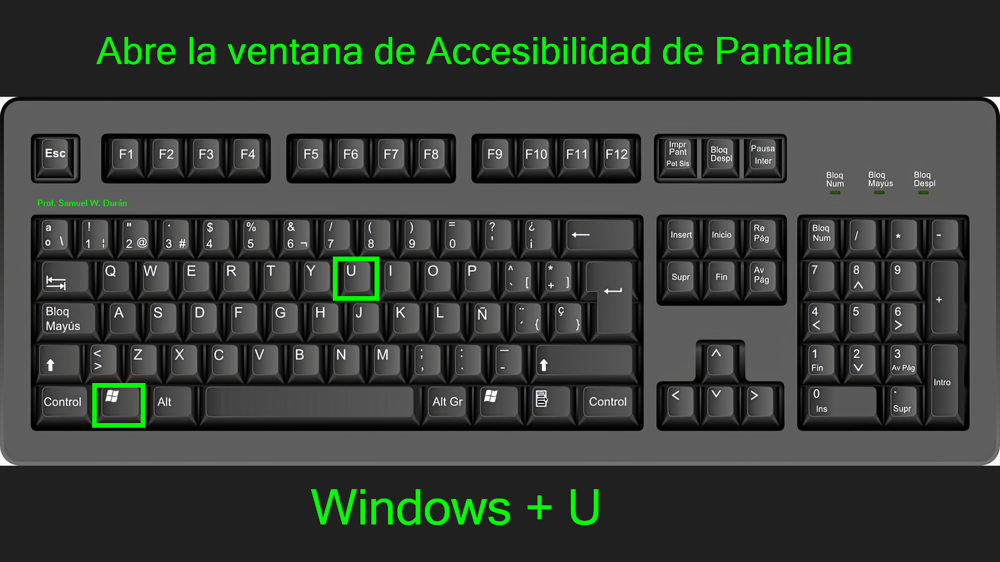
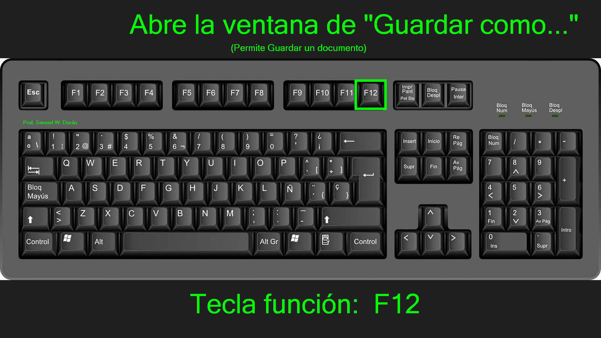
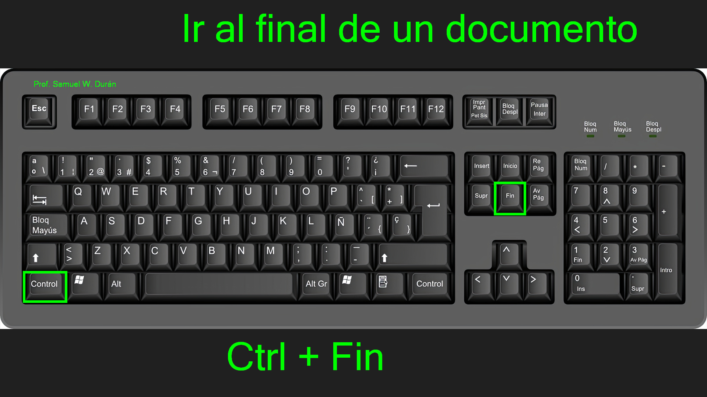
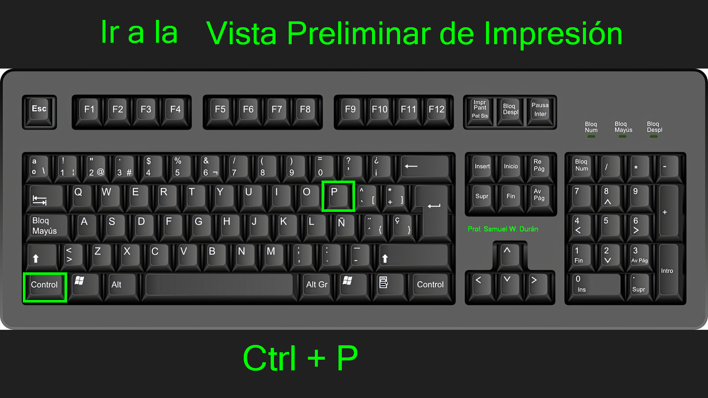

## Resumen de la Clase

El pasado sábado 17 de enero de 2026 tuvimos nuestra primera sesión introductoria a Excel.

### Temas Cubiertos:

1.  **Ventana Principal de Excel**:
    *   Partes de la ventana principal de Excel
    
    *Vista general de la interfaz de Excel (Clic sobre la imagen para enfocarla)*

2.  **Atajos de teclado**:
Un atajo de teclado es una combinación de teclas que se presionan para realizar una acción específica.
    *   `Windows + U` : Abre la pantalla de configuración de accesibilidad de Windows
        
    *   `Windows + E` : Abre la ventana del explorador de archivos
        
    *   `Ctrl + Shift + N` : Crea una nueva carpeta
        
    *   `F12` : Abre la ventana de "Guardar como"
        
    *   `Fn + F12` : Abre la ventana de "Guardar como" (En Laptop)
    *   `Ctrl + Fin` : Ir al final de un bloque de datos.
        
    *   `Ctrl + Inicio` : Ir al inicio de un bloque de datos o al inicio de la hoja
        
    *   `Ctrl + Flecha Derecha` : Ir a la última columna de un bloque u hoja
        
    *   `Ctrl + Flecha Izquierda` : Ir a la primera columna de un bloque u hoja
    *   `Ctrl + Flecha Arriba` : Ir a la primera fila de un bloque u Hoja.
        
    *   `Ctrl + Flecha Abajo` : Ir a la última fila de un bloque u Hoja.
        
    *   `Ctrl + P` : Ir a la vista preliminar de Impresión
        
    *   `Ctrl + Z` : Deshacer o volver a un estado anterior.
    *   `Ctrl + U` : Crear un nuevo libro de Excel

### Tarea
Practicar la creación de una tabla simple con el horario de la semana.
